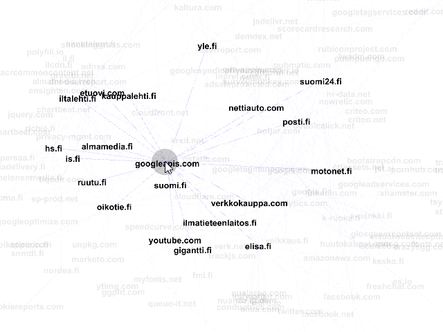

Top 50 domains network connections analysis, Finland
====================

**WORK IN PROGRESS**

An attempt to visualize (for a larger audience) the external network connections (tracking, etc) on popular Finnish websites. 
Ongoing preliminary research and prior art discovery to aid in standing on the shoulders of giants.

**For similar worldwide data and more and for relevant publications**, please see for example https://webtap.princeton.edu/software/

## Visualization

Open the [.gephi](https://github.com/koivunen/topsitenetspi/raw/master/50domainia.gephi) file in [Gephi](https://gephi.org/) to view the resulting domains and connections. 

## Prior systems / TODO
 - Crawlers
    - https://github.com/mozilla/OpenWPM
    - https://webtap.princeton.edu/software/
 - Browser based visualizers
    - TODO
    
 
## Usage

TODO
 
## License

TODO

## Credits
 - SwEng lab staff for steering the research
 - IDA Project for partial funding
 
